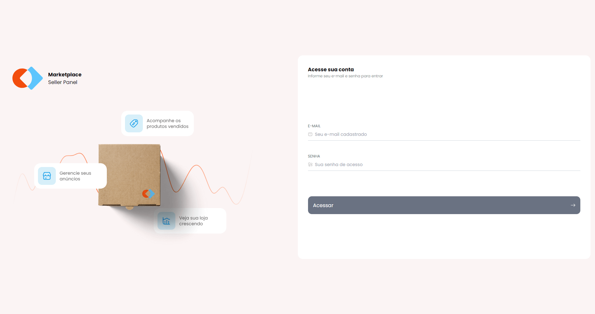
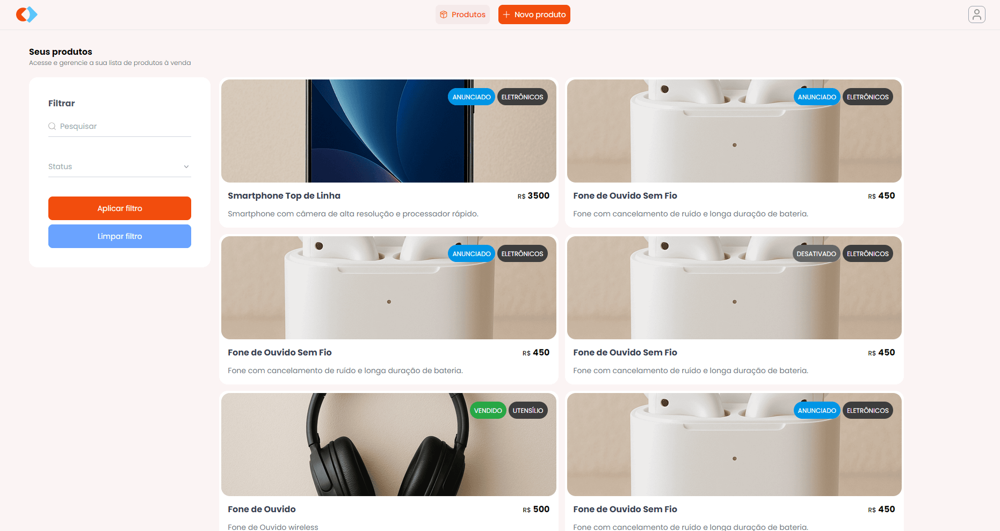
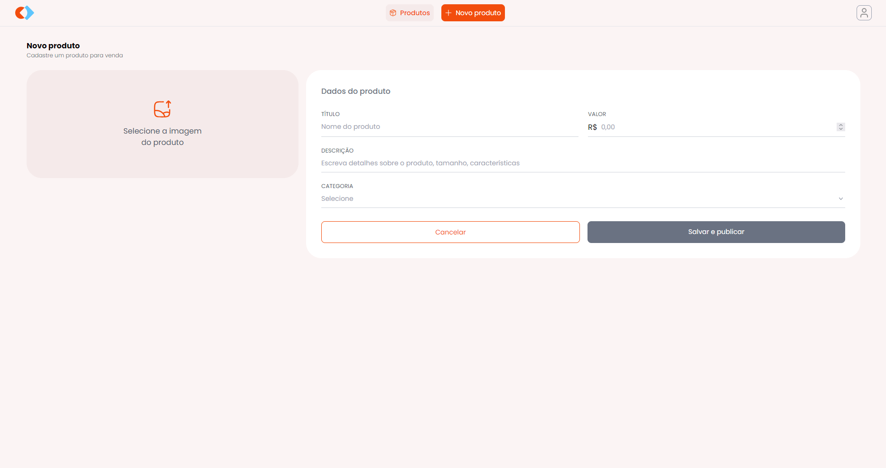

<div align="center">
    
</div>

<div align="center">

# Marketplace Seller Panel

</div>

<div align="center">
    
    <!--  -->
</div>

<div align="center">

Projeto desenvolvido utilizando Angular e Express durante o Desafio Angular na Prática da **Rocketseat**.

</div>

## 🎯 Funcionalidades Principais
Este projeto é uma simulação de um sistema de gestão de produtos que inclui as seguintes funcionalidades:

- **Tela de Login**: Autenticação de usuários.
- **Listagem de Produtos**: Exibição de produtos com opções de filtro por título e status.
- **Tela de Criação de Produto**: Interface para adicionar novos produtos ao catálogo.

O projeto é dividido em um frontend utilizando Angular e um backend utilizando Express.

Todos os cadastros de usuários e produtos são salvos localmente em arquivos JSON.

## 🎞️ Galeria

<div align="center">
  
  
  
</div>

## ⚙️ Setup e Configuração

Para rodar a aplicação, você deve iniciar tanto o servidor do backend quanto o frontend em terminais separados.

**Backend (Express):** localizado no diretório `/marketplace-seller-panel-server`

**Frontend (Angular):** localizado na raiz `/`

**OBS.:** O arquivo `marketplace-seller-panel-server.postman_collection.json`, localizado na pasta `marketplace-seller-panel-server`, contém a coleção de endpoints que podem ser importados no Postman para os testes da API.

### ⚠️ Pré-requisitos:

- **Node.js** >= 22.19.0
- **Angular CLI** >= 20
  
### 🔧 Setup:

#### Backend (Express):

1. Abra um terminal na pasta `marketplace-seller-panel-server`.
   
2. `Instalar dependências:`
   ```bash
   pnpm install
   ```

3. `Iniciar o servidor:`
   ```bash
   pnpm run dev
   ```

4. Acesse o servidor em `http://localhost:3000`

#### Frontend (Angular):

1. Abra um terminal na raiz `/`.
   
2. `Instalar dependências:`
   ```bash
   pnpm install
   ```

3. `Iniciar a aplicação:`
   ```bash
   pnpm start
   ```

4. Acesse a aplicação em `http://localhost:4200/login`
   
5. Login padrão: 
   - **Email:** example@example.com
   - **Senha:** 12345

#### Produção:
1. Alterar URL base:
   - Altere a variável `apiUrl` em `/src/environments/environment.ts` para URL desejada.

## 🌐 Rotas Disponíveis
#### Backend (http://localhost:3000):

- `/` - Rota para verificar se o servidor está em execução;
- `/api/protected` - Rotas protegidas;
- `/api/products/` - Rota para obter  os produtos;
- `/api/products/register` - Rota para cadastrar um novo produto;
- `/api/products/:id` - Rota para editar um produto por ID;
- `/api/users/login` - Rota para login do usuário;
- `/api/users/register` - Rota para cadastrar um novo usuário;
- `/api/users/profile` - Rota para obter o perfil do usuário autenticado;

#### Frontend (http://localhost:4200):

- `/login` - Formulário de Login;
- `/products` - Lista de produtos cadastrados;
- `/new-product` - Formulário para cadastro de produtos;

## ⚡ Scripts Disponíveis

- `pnpm dev` - Inicia o servidor de desenvolvimento local do Express
- `ng serve` - Inicia o servidor de desenvolvimento local do Angular
- `ng build` - Compila o projeto Angular para produção
- `ng test` - Executa os testes unitários com o Karma
- `ng e2e` - Executa os testes end-to-end
- `ng g component component-name` - Gera um novo componente Angular
- `ng g component component-name --skip-tests=true` - Gera um novo componente Angular sem testes unitários
- `ng g --help` - Exibe a lista de comandos disponíveis

## ✅ Tecnologias utilizadas

- `TypeScript`
- `Node.js - 22.19.0`
- `Express - 5.0.3`
- `Angular - 20.3.1`
- `RxJS - 7.8.2`
- `Tailwind CSS - 4.1.13`

---

<div align="center">

Desenvolvido durante o **Desafio Angular na Prática** da **Rocketseat**

</div>